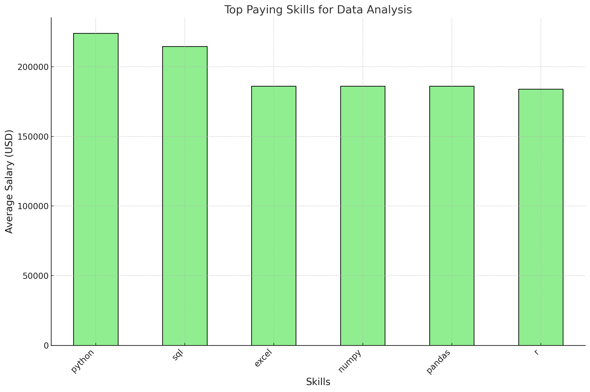

Goals of project  

You are an aspiring data nerd looking to analyze the top-paying roles and skills 

You will create SQL queries to explore this large dataset to be specific to you  

For those job searching or looking for a promotion; you can not only use this project to showcase experience BUT also to extract what roles/skills you should target...


# Data Job Market Analysis 📊 
This project dives into the Data job market.🧑🏻‍💻 Focusing on data analyst roles, this project explores top paying jobs 🔥, in demand skills and pin points where demand and salary meet in data analytics. 🏆

🔎 Sql Queries! : [SQL Project Folder](/project_sql) 

# Table of Contents
- [Understanding the Data](#)
- [Problem Statement](#Problem-Statement)
- [Questions](#Questions)
- [Process](#Steps-followed)
- [The Dashboard](#Snapshot-of-Dashboard)
- [Insights](#Insights)


## Understanding the Data
Data has been sourced from [SQL Course](https://lukebarousse.com/sql). 
The data is comprised of 787k+ rows of data on Job Postings which include Job titles, Locations and Pay along with over 3 million rows of data on the skills required within those postings. 


## About
This project was created from my drive to break into a career in data analytics. Streamlining the process of the job hunt by finding the top-paid and in-demand skills needed to secure a promising career optimally!

## Questions asked of the Data
1. Which data analyst jobs have the highest pay?
2. What skills are required for those jobs?
3. What skills are most in-demand for data analyst?
4. Which skills are associated with higher salaries?
5. What are the most optimal skills to learn? 

### Tools
- **SQL** : The foundation of the project utilized SQL in order to unearth insights.
- **PostgreSQL** : As the database management system 
- **Visual Studio Code** : My chosen editor for data-management and SQL query execution
- **Git & Github** : Used for version control and sharing SQL scripts and analysis. Ensuring collaboration and project tracking. 


# Analysis and Approach 

### [1] Top Paying Analyst Jobs

```sql
SELECT 
    job_id,
    job_title,
    job_location,
    job_schedule_type,
    salary_year_avg,
    job_posted_date,
    name AS company_name
FROM 
    job_postings_fact
LEFT JOIN company_dim ON job_postings_fact.company_id = company_dim.company_id
WHERE job_title_short = 'Data Analyst'
AND job_location = 'Anywhere'
AND salary_year_avg IS NOT NULL
ORDER BY salary_year_avg DESC
LIMIT 10
```
The breakdown of the top data analyst jobs in 2023.
- **Wide Salary Range:** Top 10 paying data analyst roles span from $184,000 to $650,000. This indicates significant salary potential in the field. 

- **Diverse Employers:** Companies like SmartAsset, Meta and AT&T are among those offering high salaries. This indicates wide interest across various industries. 

- **Job Title Variety:** There is a high variety of job titles, reflecting varied roles and specializations within data analytics. 


### [2] Skills required for those jobs

To understand what is required for those top paying jobs, I joined the job postings with skills data, providing insights into what employers value for high-pay roles
```
WITH top_paying_jobs AS (
    SELECT 
        job_id,
        job_title,
        salary_year_avg,
        name AS company_name
    FROM 
        job_postings_fact
    LEFT JOIN company_dim ON job_postings_fact.company_id = company_dim.company_id

    WHERE job_title_short = 'Data Analyst'
    AND job_location = 'Anywhere'
    AND salary_year_avg IS NOT NULL
    ORDER BY salary_year_avg DESC
    LIMIT 10
) 
```



_Bar graph visualizing data analysis skills and their associated salaries, CHATGpt generated using my SQL query results_

### [3] Most in-demand skills for data analysts

This query helped me identify the most frequently 


```
SELECT skills,
COUNT(skills_job_dim.job_id) AS demand_count
FROM job_postings_fact
INNER JOIN skills_job_dim ON job_postings_fact.job_id = skills_job_dim.job_id
INNER JOIN skills_dim ON skills_job_dim.skill_id = skills_dim.skill_id
WHERE job_title_short = 'Data Analyst'
AND job_location = 'New York, NY'
GROUP BY skills
ORDER BY demand_count DESC
LIMIT 5
```
- **SQL** and **Excel** remain fundamental which emphasize the need for strong foundational skills in data processing and spreadsheet manipulation. 

- **Programming** and **Visualizaiton** **Tools** like **Python**, **Tableau** and **PowerBI** are also essential, showing an increasing importance of technical skills in data storytelling and decision support. 


_Tabulated data for the query results, exported from excel_


 ### [4] Skills associated with higher salaries 

Exploring the average salaries with different skills revealed which which skills are highest paying. 

```
SELECT skills,
ROUND(AVG(salary_year_avg), 0) AS avg_salary
FROM job_postings_fact
INNER JOIN skills_job_dim ON job_postings_fact.job_id = skills_job_dim.job_id
INNER JOIN skills_dim ON skills_job_dim.skill_id = skills_dim.skill_id
WHERE job_title_short = 'Data Analyst'
AND job_location = 'Anywhere'
AND salary_year_avg IS NOT NULL 
GROUP BY skills
ORDER BY avg_salary DESC
LIMIT 25

```


_A breakdown of the highest paying skills:_

### [5] Most optimal skills to have

```
WITH skills_demand AS (
SELECT
    skills_dim.skill_id,
    skills_dim.skills,
    COUNT(skills_job_dim.job_id) AS demand_count
FROM job_postings_fact
INNER JOIN skills_job_dim ON job_postings_fact.job_id = skills_job_dim.job_id
INNER JOIN skills_dim ON skills_job_dim.skill_id = skills_dim.skill_id
WHERE job_title_short = 'Data Analyst'
AND job_location = 'New York, NY'
AND salary_year_avg IS NOT NULL 
GROUP BY skills_dim.skill_id
),
average_salary AS (
SELECT 
    skills_dim.skill_id,
    skills_dim.skills,
    ROUND(AVG(salary_year_avg), 0) AS avg_salary
FROM job_postings_fact
INNER JOIN skills_job_dim ON job_postings_fact.job_id = skills_job_dim.job_id
INNER JOIN skills_dim ON skills_job_dim.skill_id = skills_dim.skill_id
WHERE job_title_short = 'Data Analyst'
AND job_location = 'New York, NY'
AND salary_year_avg IS NOT NULL 
GROUP BY skills_dim.skill_id
)

SELECT 
    skills_demand.*,
    avg_salary
FROM skills_demand
INNER JOIN average_salary ON skills_demand.skill_id = average_salary.skill_id
WHERE demand_count > 10
ORDER BY 
     avg_salary DESC,
    demand_count DESC
LIMIT 25
```

 
### Dashboard Link : 
